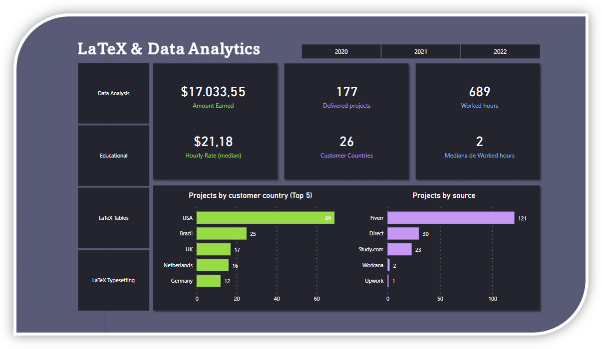
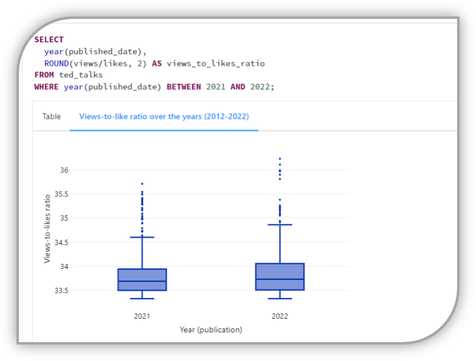

# Data Analytics Portfolio

Projects:

## Freelancing Business Report - POWER BI

> End-point of a Data Analysis regarding a Freelancing Bussines, developed by using Google Sheets, Python and Power BI.

The final product allows:
* To assess the macro scenario (KPI's and insights for all the period);
* To assess the yearly scenarios;
* To assess the service-based scenarios.

> Power BI report: [dashboard](https://app.powerbi.com/view?r=eyJrIjoiY2Q0MjY3NjctYWNjOC00Yzc0LThkNjEtYmUwYjczZjFjNTBkIiwidCI6ImU4Y2YyNjM5LTFmOTgtNGJiNC1iZDg5LWFiZDE0OTI4OTM3ZiJ9&embedImagePlaceholder=true&pageName=ReportSection)

## SQL Analysis - in Azure Databricks:

> Data: Ted Talks (2006-2022)  (5,700 rows) - available on [Kaggle](https://www.kaggle.com/datasets/miguelcorraljr/ted-talks-2022?select=20221013_ted_talks.csv).

> Deploy: Coding notebook intended to answer some business questions regarding TED Talks events that occurred from 2006 to 2022. To answer these questions, Structured Query Language (SQL) was used, as well as built-in visualizations of Databricks. [Notebook](https://databricks-prod-cloudfront.cloud.databricks.com/public/4027ec902e239c93eaaa8714f173bcfc/1499004351802398/814331625001671/6746168454129455/latest.html)

> Tools: Azure Databricks, SQL, Databricks built-in visualizations, Statitstics.

## Streamlit Web App - Data-driven solution for Brazilian Real Estate Investment Funds (FIIs)

> The project depolyed a **data-driven solution** for analyzing and getting opportunities of Brazilian Real Estate Investment Funds (known as FIIs from Brazilian portuguese - *Fundos de Investimento Imobiliário*). The deployed web-app has two main functionalities: (i) an interactive ranking of FIIs; (ii) an opportunity filter for FIIs that is based on a sector-related strategy. The active prices and indicator is updated on a daily basis. Hence, the **FIIs solution** could be used **to assist** in strategic investment **decisions**.

> FIIs data-driven solution: [pyFII](https://datafii.streamlit.app/)